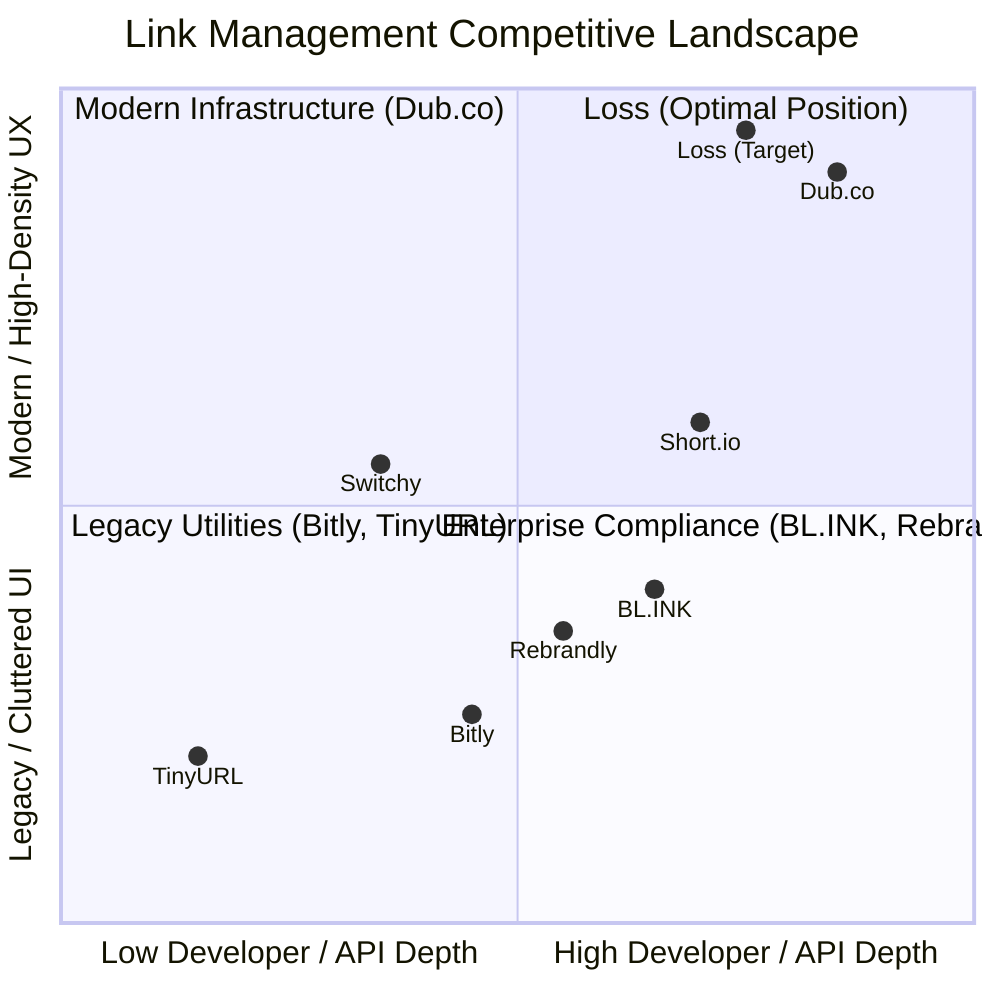
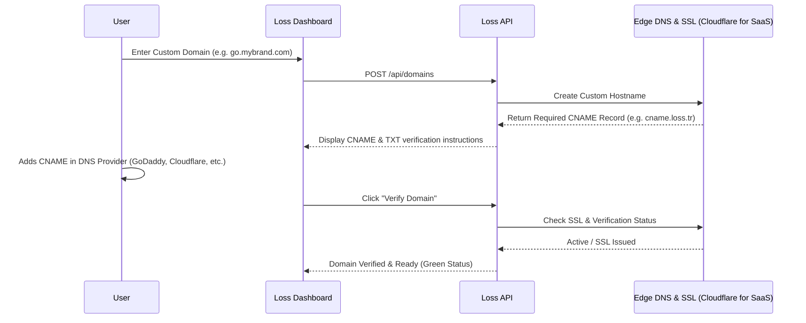
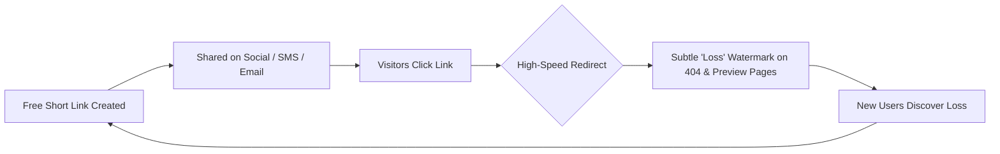
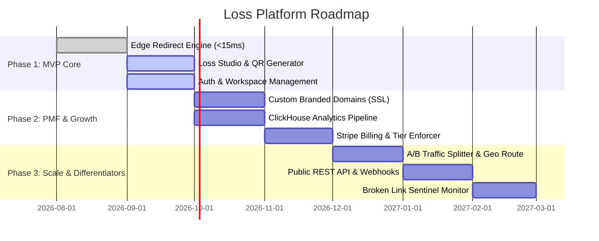

# LOSS (LONG STORY SHORT)
## Comprehensive Product Research, Competitive Intelligence & Strategic Architecture Blueprint
**Confidential Master Strategy Document | Version 3.0**

---

# 1. EXECUTIVE SUMMARY

The link management market is undergoing an unprecedented seismic shift. For over a decade, the market was dominated by legacy utilities—most notably Bitly, TinyURL, and Rebrandly. Over the last 24–36 months, these legacy platforms made severe strategic missteps: they aggressively curtailed free tiers (Bitly reducing free limits down to a suffocating 5 links/month with interstitial advertisement screens), raised entry prices above market tolerance ($12–$35/month for basic capabilities), locked core analytics behind enterprise paywalls, and allowed their user interfaces to degrade into cluttered, slow, and outdated dashboards.

Concurrently, a new generation of link infrastructure companies emerged—spearheaded by Dub.co (open-source link management raised on modern Vercel/Next.js and edge infrastructure) and Short.io (focused on custom domains and developer APIs). However, a major market vacuum remains:

1. **Legacy Giants (Bitly, Rebrandly, BL.INK)** are treated by modern creators, startups, and developers as predatory, slow, and bloated.
2. **Modern Tools (Dub.co)** are trending rapidly towards developer-centric infrastructure and raising prices, leaving mainstream digital marketers, e-commerce brands, performance advertisers, and SMBs seeking a clean, intuitive, high-velocity SaaS.
3. **Low-End Shorteners (TinyURL, Kutt, v.gd)** lack design prestige, advanced QR systems, dynamic routing, and conversion intelligence.
4. **Vibe-Coded / AI-Wrapper Prototypes** saturate Twitter and Product Hunt with flashy gradient designs, meaningless marquee tickers, and fragile backend architectures that fail at scale and erode customer trust.

### Strategic Directive for Loss ("loss.tr" / "loss.app")
Loss is not another disposable "paste URL and pray" tool. Loss is positioned as **The High-Performance Link & Conversion Infrastructure Platform**:
* **Sub-15ms Global Edge Redirection**: Instant routing powered by edge key-value memory caches.
* **Radical Clarity & Anti-Vibe Aesthetics**: Purpose-built, institutional-grade typography, monochromatic high-contrast design, zero artificial AI fluff or gimmick animations.
* **Unified Link, QR & Traffic Studio**: Eliminating the fragmented workflow of using three separate tools for shortening, dynamic QR codes, and UTM/campaign tracking.
* **Uncompromising Economics**: A genuinely usable free tier that builds organic bottom-up adoption, coupled with a transparent, value-aligned paid tier that never holds user links hostage.

---

# 2. MARKET LANDSCAPE

The global URL shortening and link management market represents an estimated **$1.8B+ annual software market**, driven by the expansion of omnichannel marketing, SMS campaigns, privacy regulations (iOS ATT, cookieless web), dynamic QR physical-to-digital touchpoints, and social commerce.



### Market Categorization
1. **The Legacy Enterprise Tier (BL.INK, Bitly Enterprise)**:
   * Focus: HIPAA/SOC2 compliance, Fortune 500 contracts, rigid governance.
   * Weakness: Slow velocity, opaque custom pricing ($500+/mo), dated interfaces.
2. **The Incumbent Utility Tier (Bitly self-serve, TinyURL)**:
   * Focus: Broad mass-market brand awareness.
   * Weakness: Deep user resentment over punitive quotas, link hijacking via interstitial ads, and aggressive upgrade traps.
3. **The Marketing & Social Growth Tier (Switchy.io, Pixelme, Sniply)**:
   * Focus: Retargeting pixels, call-to-action overlays, affiliate link cloaking.
   * Weakness: Niche focus, slow redirect speeds (often 300–800ms due to client-side JS redirects for pixel firing), high churn.
4. **The Modern Edge Infrastructure Tier (Dub.co, Short.io)**:
   * Focus: Edge speed, custom domains, modern developer DX, Clean UI.
   * Opportunity: Dub.co's pivot towards developer-first enterprise workflows leaves consumer marketers, growth teams, and international creators under-served.

---

# 3. COMPETITOR ANALYSIS

| Competitor | Primary Audience | Business Model | Free Tier Limits | Entry Paid Plan | Key Strength | Major Weakness |
| :--- | :--- | :--- | :--- | :--- | :--- | :--- |
| **Bitly** | General public, SMBs, Enterprises | Subscription (Tiered) | **5 links/mo**, 2 QR codes/mo, 0 custom domains, interstitial ads | $35/mo ($10/mo billed annually) for 100 links | Ubiquitous brand recognition | Suffocating free limits; slow UI; ads on free links; hostile pricing |
| **Dub.co** | Developers, tech startups, growth teams | Open-core / Usage-based SaaS | 1,000 events/mo, 25 clicks/link cap, 1,000 links | $24/mo ($19/mo annual) for 50k events, 3 custom domains | Open-source credibility; fast edge redirects; beautiful UI | 25 clicks/link cap on free plan breaks links quickly; dev-centric |
| **Short.io** | SMBs, marketing agencies, developers | Domain-centric Subscription | 1,000 total links, 1 custom domain, ~50k clicks/mo | $19/mo for unlimited clicks, 3 domains | Custom domain on free plan; reliable API | Outdated UI; steep jump to team features; clunky analytics |
| **Rebrandly** | Enterprise marketing, agencies | Tiered SaaS | 10 branded links total, basic click metrics | $14/mo for 250 links, 1 custom domain | Strong branded domain focus; link routing | Frequent pricing revisions; locked API; high churn |
| **BL.INK** | Enterprise, healthcare, regulated entities | Enterprise SaaS / Quote-based | 21-day trial only (No permanent free plan) | $48/mo (Standard) up to $599/mo (Business) | SOC2, HIPAA compliance; strict data governance | Prohibitive pricing for startups; zero product-led viral flywheel |
| **TinyURL** | Casual link sharing, quick utility | Ad-supported + Subscription | Unlimited raw links (unbranded, basic) | $9.99/mo for branded domains and analytics | Extreme simplicity; no login required | Archaic 2005 aesthetic; zero team features; spam reputation |
| **Switchy.io** | Performance marketers, media buyers | AppSumo / Tiered Subscription | No free plan (Trial only) | $39/mo for 10,000 clicks, 8 domains | Retargeting pixels, deep social preview cards | Slow JS-based client redirection; high latency; complex UI |

---

# 4. COMPREHENSIVE FEATURE MATRIX

| Feature Category | Feature Name | Bitly | Dub.co | Short.io | Rebrandly | Loss (Recommended) |
| :--- | :--- | :---: | :---: | :---: | :---: | :---: |
| **Core Links** | Custom Slugs / Aliases | Paid/Ltd | Yes | Yes | Yes | **Yes (Free & Paid)** |
| | Custom Branded Domains | Paid | 1 Domain | 1 Domain | Paid | **1 Domain Free; Multi Paid** |
| | Editable Destination URL | Paid | Yes | Yes | Yes | **Yes (Instant Edge Invalidation)** |
| | Link Expiration (Date / Clicks)| Paid | Paid | Paid | Paid | **Pro Tier (Clean auto-fallback)** |
| | Password Protection | Paid | Paid | Paid | Paid | **Pro Tier (Edge verified)** |
| | Batch / Bulk Link Creation | Enterprise | Paid | Paid | Paid | **CSV & Studio Bulk in Pro** |
| **Targeting & Routing** | Geo / Country Routing | Enterprise | Pro ($24+) | Paid | Enterprise | **Pro Tier (ISO alpha-2 edge)** |
| | Device (iOS/Android/Desktop) | Paid | Pro ($24+) | Paid | Paid | **Pro Tier (User-Agent edge)** |
| | A/B Split Traffic Distribution| Enterprise | Paid | Paid | No | **Pro / Business (Deterministic)**|
| | Deep Linking (App open) | Enterprise | No | Paid | Enterprise | **Smart Fallback Deep Linking** |
| **Analytics** | Real-Time Live Feed | No | Yes | No | No | **Yes (WebSocket SSE Feed)** |
| | Geo / City / Region Data | Paid | Yes | Yes | Paid | **Yes (Privacy-First MaxMind)** |
| | Device / OS / Browser | Paid | Yes | Yes | Paid | **Yes (Edge parsed)** |
| | Referrer / UTM Breakdown | Paid | Yes | Yes | Paid | **Yes (Integrated UTM Studio)** |
| | Bot Filtering / Human Verify | Paid | Yes | Basic | Basic | **Automated Zero-Latency Filter**|
| | Raw Click Log Export (CSV) | Enterprise | Pro | Paid | Enterprise | **Pro & Business** |
| **Dynamic QR Codes**| Dynamic Vector QR (SVG/PDF)| Paid | Yes | Paid | Paid | **Yes (Real vector download)** |
| | Custom Colors / Logo Embed | Paid | Yes | Limited | Paid | **Yes (Loss QR Studio)** |
| | Scan Analytics & Geolocation | Paid | Yes | Paid | Paid | **Integrated with Link Analytics**|
| **Developer / API** | REST API & Webhooks | Enterprise | Yes | Yes | Paid | **Yes (Standardized OpenAPI)** |
| | Sub-15ms Edge Latency | No (~80ms)| Yes (~20ms)| No (~60ms)| No (~110ms)| **Yes (<15ms Edge KV Cache)** |

---

# 5. FEATURE IMPORTANCE CLASSIFICATION

### MUST HAVE (Table Stakes for Credibility)
* **Editable Destination URLs**: Once a link is published or printed, changing the destination without breaking the slug is mandatory.
* **Custom Slug Selection**: Validated in real-time with instant collision checks.
* **Branded Custom Domain (At least 1 on entry/free)**: Modern teams will not use raw `loss.tr/abc` for professional campaigns.
* **Granular Analytics (Referrer, Country, Device, UTMs)**: Displayed in a responsive dashboard with time filters (24h, 7d, 30d, 90d, All).
* **Vector Dynamic QR Codes**: Instant download in SVG, PNG (high-res 300 DPI for print), and web formats.
* **Instant Keyboard Shortcuts**: Copy (`Cmd+C`), Create (`C`), Search (`/`).

### SHOULD HAVE (Strong Competitive Advantage)
* **Social Metadata Customization (OG Tags)**: Override title, description, and preview thumbnail for social cards (Twitter, LinkedIn, WhatsApp).
* **Smart Device & Geo Routing**: Automatically direct iOS users to the App Store, Android to Google Play, and desktop to a web landing page.
* **Password-Protected & Sensitive Content Warnings**: Encrypted edge gates for confidential documents or embargoed press releases.
* **Auto-Expiring Links**: Capped by total clicks or date-time with custom 404/redirect fallback.
* **Automated Broken Link Monitoring**: Background cron jobs pinging destination URLs to notify owners when their links result in 404 or 500 errors.

### DIFFERENTIATORS (Market Supremacy Drivers)
1. **Zero-Friction Anonymous "Try Before Registering" Studio**: Let visitors generate, test, and preview custom slugs and QR codes instantly on the homepage, with persistent local cache that migrates seamlessly to an account upon 1-click Google Sign-In.
2. **Deterministic A/B Traffic Splitter**: Effortlessly split traffic between two or three landing pages (e.g., 50/50 or 70/30) without paying $300/mo for Optimizely or VWO.
3. **Loss QR Studio with Print-Safe Precision**: Live dynamic preview with CMYK color palette presets, scannability score testing, and high-resolution vector export.
4. **UTM Builder Presets**: Built-in marketing campaign presets (Meta Ads, Google Ads, Newsletter, Twitter) that automatically build and sanitize query parameters.
5. **Edge Redirect Speed (<15ms)**: Leveraging global KV edge stores (Cloudflare Workers / Vercel Edge) so redirects occur before the user's browser even completes DNS handshake.

### AVOID (Feature Traps & Anti-Patterns)
* **Interstitial Ads**: Bitly's fatal mistake. Never hijack user clicks with third-party ads.
* **Client-Side JavaScript Redirection for Pixels**: Injects 500ms+ latency, destroys mobile UX, and is blocked by 40%+ of modern ad-blockers. Use server-side Conversions API (CAPI) instead.
* **Complex "Link-in-Bio" Builders (Bento / Linktree clones)**: Dilutes the core mission into a crowded, low-margin website builder space. Keep focus razor-sharp on link infrastructure.
* **Arbitrary "Pay-Per-Link" Hard Blocks on Free Users**: Forcing users to delete old links creates intense friction. Cap analytics events or advanced features instead.

---

# 6. CUSTOMER PAIN POINTS: VOICE OF THE MARKET

Synthesized from verified discussions on Reddit (r/SaaS, r/marketing, r/webdev), Trustpilot, G2, and Hacker News:

### Pain Point 1: "The Bitly Bait-and-Switch"
> *"I used Bitly for 4 years. Suddenly they slashed free links to 5 per month. 5! And they started showing ads to my visitors. I was forced to migrate 300 links in panic."*
* **Root Cause**: Desperate monetization of legacy debt.
* **Loss Opportunity**: Offer a generous, sustainable baseline (e.g., 25 new links/mo, 1,000 tracked clicks) and guarantee that created links **never stop redirecting**, even if account analytics limits are exceeded.

### Pain Point 2: "The Dub.co 25-Click Free Cap"
> *"I loved Dub until my link hit 25 clicks and the dashboard completely stopped tracking analytics. It felt like a demo rather than a free tier."*
* **Root Cause**: Aggressive event quotas designed exclusively to force developers into the $24/mo tier.
* **Loss Opportunity**: Provide workspace-level click allowances (e.g., 1,000 aggregate clicks/mo) rather than a punitive per-link ceiling.

### Pain Point 3: "Broken QR Codes in Print"
> *"We printed 5,000 brochures with a shortener's QR code. When the promotion ended, the shortener wouldn't let us edit the destination URL without upgrading to their $99/mo enterprise plan."*
* **Root Cause**: Holding destination URLs hostage behind paywalls.
* **Loss Opportunity**: Editable destination URLs must be a standard baseline for all registered users.

### Pain Point 4: "Slow, Bloated, Cluttered Dashboards"
> *"Why does it take 4 seconds and 3 clicks just to shorten a link? Why is every link shortener full of popups asking me to book a demo?"*
* **Root Cause**: Enterprise sales-led growth over product-led design.
* **Loss Opportunity**: Sub-second UI loading, instantaneous search, and keyboard-first ergonomics.

---

# 7. MARKET OPPORTUNITIES

1. **The "Disillusioned Marketer" Exodus**: Millions of marketers and agency owners are actively searching for a modern, reliable Bitly replacement that doesn't cost $35/mo.
2. **The Dynamic QR Revolution**: Restaurants, packaging, event organizers, and realtors require dynamic QR codes that never expire and allow instant destination swapping.
3. **The Clean Edge Advantage**: Startups and modern engineering teams demand sub-15ms redirect speeds with global uptime SLAs and zero redirects through tracking intermediaries.
4. **Local & Regional Brand Sovereignty (`loss.tr` / `loss.app`)**: A clean, memorable 4-letter brand with a crisp national and international presence.

---

# 8. PRODUCT POSITIONING

### Core Positioning Statement
> **Loss is the high-performance link and conversion infrastructure platform for modern growth teams, marketers, and developers.** It replaces sluggish legacy shorteners with instantaneous edge redirection, precision dynamic QR codes, and institutional-grade campaign analytics.

### Value Proposition
* **For Marketers**: "Turn every link into an intelligent conversion touchpoint with custom domains, UTM presets, and dynamic routing."
* **For Developers**: "Sub-15ms edge redirects, 99.99% uptime, and clean RESTful APIs that scale to millions of requests without breaking the bank."
* **For Creators & Businesses**: "Branded links and dynamic QR codes that you truly own—never hijacked, never throttled, always active."

---

# 9. TARGET PERSONAS & JOBS TO BE DONE

### Persona 1: The Performance Marketer (Alex, 31)
* **Context**: Runs paid Meta, Google, and TikTok ads for e-commerce brands.
* **Pain**: Messy UTM tracking, link degradation, broken campaign analytics.
* **Jobs to be Done**:
  * "When I launch a campaign, I need to generate tagged, clean short links in under 10 seconds so my ad tracking is flawless."
  * "When a product sells out, I need to instantly redirect traffic to a backorder page without touching the live ads."

### Persona 2: The Modern Developer / Founder (Elena, 28)
* **Context**: Building a SaaS application or developer tool; needs programmatically generated links and custom domains.
* **Pain**: Bitly API costs $300+/month; open-source self-hosting requires maintaining Redis, Postgres, and Docker infrastructure.
* **Jobs to be Done**:
  * "I need an API with predictable webhooks and TypeScript SDKs to generate user invite links and track onboarding conversions."

### Persona 3: The Event / Operations Manager (Burak, 36)
* **Context**: Coordinates conferences, hospitality, retail signage, and printed materials.
* **Pain**: Printing static QR codes that become useless once dates or URLs change.
* **Jobs to be Done**:
  * "I need dynamic vector QR codes that I can edit months after physical banners are printed."

---

# 10. PRODUCT ARCHITECTURE & DATA FLOW

The platform architecture decouples **The High-Speed Redirect Engine (Read Path)** from **The Management & Analytics Pipeline (Write Path)**:

```mermaid
flowchart TD
    subgraph Client Traffic
        User[End Visitor]
        Admin[Dashboard / API User]
    end

    subgraph Edge Layer (Cloudflare / Vercel Edge)
        EdgeWorker[Global Edge Worker / <15ms]
        EdgeKV[(Edge KV Cache)]
    end

    subgraph Core Ingestion & Storage
        RedirectDB[(Primary Link DB - Firestore / Postgres)]
        EventQueue[Event Stream / Kafka / Redis Streams]
        ClickHouse[(Analytics Engine / ClickHouse)]
    end

    User -->|GET loss.tr/slug| EdgeWorker
    EdgeWorker -->|1. Lookup Slug| EdgeKV
    EdgeKV -.->|Cache Miss| RedirectDB
    EdgeWorker -->|2. Async Click Event| EventQueue
    EdgeWorker -->|3. 301/302 Redirect| User
    
    EventQueue --> ClickHouse
    Admin -->|CRUD Links / View Stats| RedirectDB
    ClickHouse -->|Aggregated Metrics| Admin
```

### Decoupling Guarantees
1. **Redirect Latency**: Under 15ms globally because 99%+ of link lookups resolve directly from the distributed Edge KV cache.
2. **Zero Blast Radius**: If the analytics ingestion pipeline or primary database undergoes maintenance, edge redirects continue without interruption.
3. **Permanent Link Integrity**: A user reaching their monthly analytics quota never causes an edge redirect failure; clicks simply bypass analytics ingestion.

---

# 11. INFORMATION ARCHITECTURE & NAVIGATION

### Structural Layout (Dashboard Mode)
The application shell features a collapsible, high-density sidebar with explicit workspace contexts:

```
Loss Application Architecture
│
├── [Global Command Bar] (Cmd+K / Ctrl+K)
│   ├── Quick Action: Create Short Link ('C')
│   ├── Quick Action: Create Dynamic QR ('Q')
│   ├── Navigation: Jump to any Link, Domain, or Page
│   └── System Settings & Theme Switcher
│
├── [Sidebar Navigation]
│   ├── Workspace Selector (Personal / Agency / Org Switcher)
│   ├── 🔗 Links (All Links, Tagged Folders, Active, Expired, Archived)
│   ├── 📊 Analytics (Unified Overview, Realtime Stream, Geo, Referrers, UTMs)
│   ├── 📱 QR Codes (Dynamic Studio, Vector Downloads, Templates)
│   ├── 🌐 Custom Domains (Branded Domains, DNS Verification, SSL Health)
│   ├── ⚙️ Settings (Workspace Members, API Keys, Webhooks, Billing)
│
└── [Header / Topbar]
    ├── Breadcrumbs & Active Workspace Status
    ├── Quick Create Button ("+ New Link")
    └── User Profile & Security Center
```

---

# 12. USER EXPERIENCE & ACTIVATION STRATEGY

### 1. Anonymous First-Link Flow (The Instant Hook)
* **Zero Friction**: The homepage features a functional, live studio input.
* **Immediate Reward**: User pastes a URL $\rightarrow$ Loss generates an interactive preview showing original URL, shortened slug, estimated character savings, and a dynamic QR code preview.
* **The Magic Moment**: User can test the link in real-time or copy it with 1 click.
* **Seamless Claiming**: When the user clicks "Save & Track Analytics", a modal opens offering instant 1-click Google Sign-In. The newly created link is automatically attached to their new account.

### 2. The Power-User Keyboard Loop
* **`C`**: Opens Quick Create Modal.
* **`Cmd+K`**: Opens Spotlight Command Palette.
* **`/`**: Focuses search input across all links and tags.
* **`Cmd+C` on a selected row**: Copies short link directly to clipboard with a subtle 1.5s toast confirmation.

---

# 13. ANTI-VIBE-CODED DESIGN GUIDELINES

### What is "Vibe-Coded" and Why Does It Kill Enterprise Conversions?
"Vibe-coded" refers to the pervasive wave of AI-generated SaaS templates featuring:
* Oversaturated neon purple-to-cyan gradient blobs in every corner.
* Cluttered marquee tickers showing fake logos ("As seen on TechCrunch, Forbes, Bloomberg").
* Massive, empty glassmorphism cards with 40px padding and barely readable 11px gray text.
* Gimmicky 3D floating spheres, floating pills, and distracting bouncy hover animations.
* Fake testimonials with generic AI headshots and generic names ("John D., Marketing Guru").

This aesthetic immediately signals: **"This is an amateur weekend project that will be abandoned in 3 months."**

### The Institutional-Grade Design Rules for Loss
1. **Monochrome Foundation**: Base colors must be high-contrast, deep neutrals (Zinc `#09090b` for dark mode, crisp White `#ffffff` with neutral borders `#e4e4e7` for light mode).
2. **Intentional Accent Color**: Use a single, razor-sharp accent (Electric Emerald `#10b981` or Precision Cobalt `#2563eb`). Never mix rainbow gradients.
3. **High-Density Data Presentation**: Users with 500 links want compact, clean tabular views with tabular numbers (`font-variant-numeric: tabular-nums`), crisp 1px borders, and clear status badges.
4. **Real Micro-Feedback over Bouncy Animations**: Transitions must be instant (100–150ms ease-out). No 600ms slow fades or bouncing modal dialogues.
5. **Legitimate Social Proof**: Replace fake quote marquees with raw, verified metrics: total redirects served, global latency status (p99 < 15ms), and open status uptime badges.

---

# 14. LOSS DESIGN SYSTEM TOKENS

### 1. Typography
* **Primary UI Font**: Inter or Geist Sans (`-apple-system, BlinkMacSystemFont, "Segoe UI", Roboto, sans-serif`).
* **Monospace / Code Font**: JetBrains Mono or Geist Mono (for slugs, destination URLs, IP addresses, and API keys).
* **Hierarchy**:
  * Page Title: `24px` / Semibold (`600`) / Tracking `-0.02em`
  * Section Header: `18px` / Medium (`500`) / Tracking `-0.01em`
  * Table Header: `12px` / Medium (`500`) / Uppercase / Tracking `+0.05em`
  * Table Body: `13px` / Regular (`400`) / Tabular Nums
  * Sub-text / Captions: `12px` / Regular (`400`) / Muted

### 2. Color Palette (Dual-Mode Tokens)

| Token Name | Light Mode Value | Dark Mode Value | Usage |
| :--- | :--- | :--- | :--- |
| `--loss-bg` | `#ffffff` | `#09090b` | Main application canvas |
| `--loss-surface` | `#f4f4f5` | `#121215` | Cards, table containers, popovers |
| `--loss-border` | `#e4e4e7` | `#27272a` | 1px subtle architectural dividers |
| `--loss-text-primary` | `#09090b` | `#fafafa` | Headings, active values |
| `--loss-text-muted` | `#71717a` | `#a1a1aa` | Labels, timestamps, secondary URLs |
| `--loss-accent` | `#0284c7` | `#38bdf8` | Primary interactive elements, selection |
| `--loss-success` | `#16a34a` | `#22c55e` | Active status, low latency, copied state |
| `--loss-danger` | `#dc2626` | `#ef4444` | Deletion, expired status, domain error |

### 3. Spacing & Radius Standards
* **Radius Tokens**: `radius-sm: 4px`, `radius-md: 6px`, `radius-lg: 8px`. (Avoid bubbly 24px/32px rounded corners on functional enterprise cards).
* **Spacing Scale**: Multiples of 4px (4px, 8px, 12px, 16px, 24px, 32px, 48px).

---

# 15. LANDING PAGE ARCHITECTURE & CRO BLUEPRINT

The landing page must convince a visitor within **5 seconds** that this is an established, high-velocity infrastructure tool:

1. **Top Navigation**: Clean bar with Loss logo, Product, Pricing, API Docs, Changelog, and "Sign In / Get Started".
2. **Hero Section (Functional Above the Fold)**:
   * **Headline**: "Link Infrastructure Built for Speed and Control."
   * **Subhead**: "Create branded short links, dynamic QR codes, and intelligent redirects with sub-15ms global latency."
   * **Interactive Studio Widget**: A live, working shortener right in the hero. Paste a link $\rightarrow$ pick a custom slug $\rightarrow$ get a live redirect URL and QR code instantly.
3. **Architecture Proof Section**: "Why Edge Redirects Matter" (Comparing 14ms Loss edge redirection vs. 120ms legacy shorteners).
4. **Interactive Feature Deep-Dives**:
   * *Dynamic QR Studio*: Live slider changing QR pattern, corner radius, and color.
   * *Smart Routing*: Visual branching diagram showing iOS $\rightarrow$ App Store, Android $\rightarrow$ Play Store.
   * *Analytics Studio*: Live interactive chart preview with real filters.
5. **Transparent Pricing Grid**: Side-by-side comparison with zero hidden limits.
6. **Developer Integration Callout**: Copy-pasteable `curl` and `npm install @loss/sdk` snippets.
7. **FAQ & Infrastructure SLA Guarantee**: Addressing uptime, data ownership, and domain migration.

---

# 16. DASHBOARD & LINK MANAGEMENT EXPERIENCE

### Designing for Scale (5 to 50,000 Links)
A user with 5 links needs simplicity; an agency with 15,000 links needs high-performance data grids:

1. **Virtualized High-Density Table**:
   * Columns: Checkbox, Status Pill (Active / Scheduled / Expired), Short URL & Favicon, Destination URL (truncated with hover preview), Total Clicks (with 7-day sparkline), Tags, Date Created, Quick Actions (Copy, QR, Edit, Analytics, Archive).
   * Infinite scrolling with virtualization to handle 10,000+ rows at 60 FPS.
2. **Multi-Select Batch Actions**:
   * Select all $\rightarrow$ Batch Tag, Batch Export (CSV), Batch Change Domain, Batch Archive, Batch Delete.
3. **Deep Filter Engine**:
   * Filter by: Custom Domain, Tag/Folder, Creation Date Range, Click Volume ($>1,000$), Expiration Status, Target Destination Regex.
4. **Inline Quick Editing**:
   * Double-click on destination URL to update it inline with immediate edge cache invalidation.

---

# 17. ANALYTICS ARCHITECTURE & CAPABILITIES

Modern link analytics must be **privacy-first (cookieless, GDPR compliant)** yet deeply actionable:

```
Analytics Dashboard Hierarchy
│
├── [Global Summary KPI Bar]
│   ├── Total Clicks (with % change vs. previous period)
│   ├── Unique Visitors (hashed IP + User-Agent fingerprint)
│   ├── Top Performing Country & City
│   └── Top Referrer (Direct, Twitter/X, Instagram, Google)
│
├── [Time-Series Visualizer]
│   ├── Granular intervals: Hourly (for 24h), Daily (for 30d), Weekly (for 90d)
│   └── Multi-link comparative overlay (Compare Link A vs. Link B)
│
├── [Multi-Dimensional Breakdown Grids]
│   ├── Geographic Heatmap (Clickable down to Region and City)
│   ├── Devices & Browsers (iOS, Android, macOS, Windows, Linux / Chrome, Safari, etc.)
│   ├── Referrers & Cleaned Source Domains
│   └── UTM Parameters (Source, Medium, Campaign, Term, Content)
│
└── [Realtime Activity Stream]
    └── Live SSE (Server-Sent Events) feed showing clicks as they occur globally
```

---

# 18. DYNAMIC QR CODE STUDIO STRATEGY

QR codes are no longer novelty items; they are the primary bridge between physical collateral and digital conversions:

1. **Dynamic Re-pointing**: The QR code encodes `loss.tr/qr-slug`. The destination can be altered at any time without changing the printed QR matrix.
2. **Vector Download Formats**:
   * **SVG**: Infinite resolution for graphic designers and billboards.
   * **PNG**: 1024x1024 and 4096x4096 (300 DPI) for print and digital publishing.
   * **PDF**: Ready for direct submission to commercial printing presses.
3. **Loss QR Customizer**:
   * Dot Patterns: Standard square, rounded dots, smooth micro-capsules.
   * Corner Eyes: Square, rounded circle, double-ring.
   * Center Logo Embedding: Upload high-res SVG/PNG with automatic contrast padding and error correction (Level H - 30% redundancy).
   * Color Customization: Dual-tone brand palette with built-in contrast checker ensuring >4.5:1 ratio for scannability.

---

# 19. CUSTOM DOMAIN INFRASTRUCTURE

Branded domains increase click-through rates by up to **34%** compared to generic short domains:

### Automated Domain Provisioning Workflow


* **Root Domain & Subdomain Support**: Seamless configuration for both `brand.link` (apex) and `go.brand.com` (subdomain).
* **Automatic Free SSL**: Zero-configuration SSL certificates issued via Let's Encrypt / Cloudflare SSL for SaaS.
* **404 Fallback & Root Redirect**: Configure where visitors land if they visit `go.brand.com/` (without a slug) or type an invalid slug.

---

# 20. DEVELOPER & API ARCHITECTURE

Loss is designed API-first. Every action available in the web dashboard is powered by the public REST API:

### Core API Endpoints
* `POST /v1/links`: Create short link (supports custom slugs, tags, expiration, routing rules, UTMs).
* `GET /v1/links`: List links with pagination, sorting, and tag filters.
* `GET /v1/links/:id`: Retrieve single link metadata and realtime stats.
* `PATCH /v1/links/:id`: Update destination, slug, or expiration (instant edge invalidation).
* `DELETE /v1/links/:id`: Archive or hard delete link.
* `GET /v1/analytics`: Query aggregated metrics across workspaces or individual links.
* `POST /v1/qr`: Generate on-the-fly vector QR codes.

### Developer Tooling & SDKs
* Standardized OpenAPI 3.1 Specification.
* Official TypeScript SDK (`@loss/sdk`) and Python SDK (`loss-python`).
* HMAC-SHA256 Signed Webhooks for real-time click event streaming (payload includes timestamp, linkId, country, device, and referrer).

---

# 21. SECURITY, COMPLIANCE & ABUSE PREVENTION

URL shorteners are primary targets for phishing and malware distributors. Without automated defenses, the primary domain (`loss.tr` / `loss.app`) risks getting blacklisted by Google Safe Browsing and Spamhaus.

### Multi-Layered Defense Architecture
1. **Real-Time Pre-Flight Destination Scanning**:
   * Every created link is asynchronously verified against the **Google Safe Browsing API** and **Cloudflare Radar**.
   * Any URL pointing to known malware, credential-harvesting phishing domains, or malicious binaries is immediately blocked.
2. **Suspicious Keyword & Pattern Heuristics**:
   * Slugs or destinations containing patterns like `login-paypal`, `verify-appleid`, `banking-secure`, or IP-address destinations (`http://192.168...`) are held in quarantine for automated sandbox inspection.
3. **Adaptive Rate Limiting**:
   * Anonymous users: 10 links/hour per IP.
   * Free accounts: 60 links/hour.
   * Pro/Business accounts: 1,000+ links/minute with idempotency keys.
4. **Public Abuse Reporting System**:
   * Accessible link footer (`loss.tr/abuse`) enabling any user or security researcher to submit malicious links for instant quarantine.

---

# 22. MONETIZATION & PRICING STRATEGY

### Strategic Principles
1. **Never Hold Links Hostage**: Once a link is published, it should redirect indefinitely. If a user exceeds their tier's monthly click quota, the link **continues to redirect**; analytics tracking pauses or aggregates until the next cycle.
2. **Feature & Volume Alignment**: Free users get essential tools; businesses pay for scale, custom domains, and collaboration.

### Proposed Tier Architecture

| Plan | Monthly Price | Annual Price | Active Links | Tracked Clicks / Mo | Custom Domains | Key Features Included |
| :--- | :--- | :--- | :--- | :--- | :--- | :--- |
| **Free** | **$0** | **$0** | 50 Links | 1,500 Clicks/mo | 1 Domain | Unlimited raw redirects, standard QR codes, 30-day analytics, custom slugs |
| **Starter** | **$12/mo** | **$9/mo** ($108/yr) | 500 Links | 25,000 Clicks/mo | 2 Domains | Editable destinations, password links, custom OG social tags, 90-day analytics |
| **Pro (Growth)**| **$29/mo** | **$24/mo** ($288/yr)| 2,500 Links | 150,000 Clicks/mo| 5 Domains | Smart geo/device routing, A/B split testing, vector SVG QR studio, 1-year analytics, 3 team members |
| **Business** | **$79/mo** | **$64/mo** ($768/yr)| 15,000 Links | 750,000 Clicks/mo| 15 Domains | Full REST API & Webhooks, broken link monitor, unlimited analytics history, 10 team seats, priority edge SLA |
| **Enterprise** | Custom | Custom | Unlimited | Millions | Unlimited | Dedicated IP, SSO/SAML, custom contract, 99.99% uptime SLA, audit logs |

---

# 23. CONVERSION RATE OPTIMIZATION & UPGRADE TRIGGERS

Conversion must feel like a logical graduation, never an ambush:

1. **The Custom Domain Gate**: A user with 1 free domain tries to add a second brand domain $\rightarrow$ Crisp modal: *"Connect multiple branded domains to separate your client projects."*
2. **The High-Impact Routing Teaser**: In the link creation modal, options for *Device Targeting (iOS/Android)* and *A/B Split Testing* are clearly visible with an elegant "Pro" badge. Clicking reveals a 15-second interactive interactive preview of smart routing.
3. **The Analytics Retention Milestone**: At day 31, analytics charts display a subtle banner: *"Viewing last 30 days. Upgrade to Pro for unlimited 365-day trend analysis and raw CSV export."*
4. **Zero Forced Annual Locks**: Offer honest monthly billing with a clean 20% annual discount incentive.

---

# 24. PRODUCT-LED GROWTH (PLG) FLYWHEEL



* **Branded Footers on Utility Pages**: When a visitor accesses a password-protected link or a scheduled link waiting room, a minimalist footer reads: *"Powered by Loss • The High-Speed Link Platform."*
* **Shareable Public Analytics**: Users can toggle a link's analytics to "Public" with a shareable URL (e.g. `loss.tr/analytics/launch-stats`), creating organic virality in Twitter build-in-public and startup communities.
* **Loss QR Attribution**: Free downloadable vector QR codes include a high-precision, subtle center mark that can be removed on paid plans.

---

# 25. SEO & ACQUISITION STRATEGY

Direct search intent for link tools is massive. We capture it through high-intent programmatic landing pages:

1. **Comparison Pages**:
   * `/compare/bitly-alternative` (Targeting searchers frustrated by Bitly's 5-link limit)
   * `/compare/short-io-alternative`
   * `/compare/rebrandly-alternative`
2. **Free Standalone Micro-Tools**:
   * `/tools/utm-builder` (Interactive campaign URL generator)
   * `/tools/qr-code-generator` (Free high-res vector QR maker)
   * `/tools/http-status-checker` (Fast redirect chain analyzer)
3. **Educational Programmatic Glossaries**:
   * Articles explaining 301 vs. 302 redirects, deep linking for mobile apps, and custom CNAME domain configuration.

---

# 26. TECHNICAL ARCHITECTURE SPECIFICATION

### The Production Stack
* **Client Application**: React 19, Vite, Lucide Icons, Modular Vanilla CSS Design System.
* **Global Edge Network**: Cloudflare Workers / Vercel Edge Runtime for sub-15ms redirects.
* **Edge Storage**: Cloudflare KV / Upstash Redis for ultra-low latency link resolution.
* **Primary Relational Store**: PostgreSQL (Supabase / Neon) or Firebase Firestore for workspace governance and user configurations.
* **Analytics Engine**: ClickHouse (via Tinybird or self-hosted) for ingesting millions of click events with instant sub-second SQL aggregation.
* **Authentication**: Firebase Auth / Supabase Auth with Google OAuth, GitHub OAuth, and Magic Links.

---

# 27. SCALABILITY & INFRASTRUCTURE ROADMAP

### Capacity Milestones

| Scale Level | Monthly Redirects | Edge Caching Strategy | Analytics Storage | Primary Bottlenecks & Mitigations |
| :--- | :--- | :--- | :--- | :--- |
| **Stage 1 (1k Users)** | 500,000 | In-memory Edge KV (TTL 24h) | Direct DB Writes | None; single node infrastructure is sufficient |
| **Stage 2 (50k Users)** | 25,000,000 | Multi-region Edge KV + Redis | Event Ingestion Queue (Redis Stream) | Shift analytics writes out of primary DB into streaming buffers |
| **Stage 3 (1M Users)** | 500,000,000 | Global Anycast Edge + Stale-While-Revalidate | ClickHouse Columnar Cluster | Shard link lookup KV keys; separate read/write database replicas |
| **Stage 4 (10M+ Users)**| 5,000,000,000+ | Distributed Edge Memory Matrix | Partitioned Multi-Node ClickHouse | Dedicated IP ranges; automated bot quarantine at edge layer |

---

# 28. INTERNAL ADMIN & OPERATIONS SYSTEM

The internal operational control plane (`/admin`) is essential for platform health:
* **Real-time Abuse Radar**: Auto-flagged links queue with one-click quarantine and destination inspection.
* **Domain Health Dashboard**: Monitoring global DNS propagation and SSL expiration across all user-connected custom domains.
* **Tenant & Account Impersonation**: Read-only support view to diagnose customer configuration issues instantly.
* **Global Telemetry**: Real-time p50, p95, and p99 redirect latency graphs across global edge nodes.

---

# 29. THE 10 PILLARS OF COMPETITIVE DIFFERENTIATION

1. **True Sub-15ms Edge Latency**: Noticeably faster redirects than Bitly or Rebrandly.
2. **The "Permanent Link" Guarantee**: Created links never break, even if accounts downgrade or exceed analytics limits.
3. **Loss QR Studio**: Commercial-grade vector QR generator (SVG/PDF) with embedded logos and print-safe CMYK modes.
4. **Deterministic A/B Traffic Splitter**: Enterprise-grade split testing available without enterprise software bloat.
5. **No Vibe-Coded Fluff**: Purpose-built, institutional, high-density interface built for serious professionals.
6. **Smart Fallback Deep Linking**: Seamlessly open native iOS/Android apps with graceful fallback to web landing pages.
7. **Integrated UTM Campaign Presets**: Standardize tagging across marketing teams to eliminate analytics errors.
8. **Automated 404 & Broken Link Sentinel**: Constant background health checks alerting users when target landing pages go down.
9. **Accessible Pricing with 1 Free Branded Domain**: Giving solo creators and startups the dignity of a branded domain on the free tier.
10. **Radical Data Sovereignty**: 1-click export of complete link configurations and raw click logs.

---

# 30. PRODUCT ROADMAP & EXECUTION PHASES



---

# 31. FINAL SPECIFICATION: THE IDEAL URL MANAGEMENT PLATFORM

The ideal link management platform is not a toy; it is **critical digital infrastructure**.
* **It never fails**: Links are redundant, globally distributed, and cached at the edge.
* **It respects user intelligence**: Interfaces are dense, fast, and keyboard-operable.
* **It bridges digital and physical**: QR codes are treated as first-class vector assets.
* **It provides clarity**: Analytics tell a clear story of who clicked, where they came from, and which campaign generated the conversion.

---

# IF I WERE BUILDING THIS COMPANY FROM ZERO

### 1. What I Would Build First (Day 1 to 30)
I would build only three things:
* A rock-solid Edge Redirect Worker on Cloudflare or Vercel Edge with Upstash Redis KV that resolves slugs in under 15ms.
* A single, impeccably designed, keyboard-accessible table interface with instant inline editing, search, and copy shortcuts.
* An automated custom domain onboarding flow that provisions Let's Encrypt SSL certificates automatically.

### 2. What I Would Deliberately NOT Build Initially
* No complex "Link-in-bio" microsite builders (competing with Linktree is a distraction).
* No client-side tracking pixels (they slow down redirects, get blocked by adblockers, and create privacy nightmares).
* No native mobile apps (a responsive, high-density PWA web interface delivers 100% of the required functionality).

### 3. What I Would Make Free vs. What I Would Charge For
* **Free Forever**: 50 active links, 1 custom domain, 1,500 tracked clicks/month, unlimited basic redirects, dynamic vector QR codes.
* **Paid Features ($12–$29/mo)**: Multiple custom domains, smart geo/device routing, A/B split testing, team workspaces, broken link monitoring, and extended 1-year analytics history.

### 4. How I Would Dethrone Bitly
I would launch a targeted campaign highlighting: **"Bitly gives you 5 links and shows ads to your visitors. Loss gives you 50 links, your own custom domain, vector QR codes, and sub-15ms edge redirects for $0."** This single positioning angle taps into years of accumulated user resentment and drives organic viral migration.

### 5. The Ultimate Moat
In the link business, the ultimate moat is **Trust and Domain Longevity**. Once thousands of businesses route their mission-critical links through `loss.tr` / `loss.app`, the switching cost is immense. By offering transparent pricing, flawless uptime, and uncompromising performance, Loss establishes itself as the modern standard for link infrastructure.
